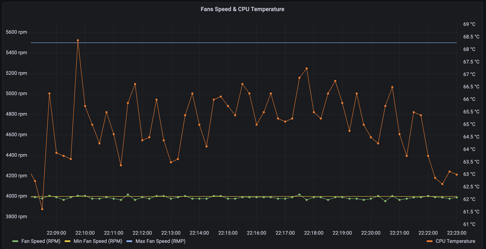

# OSX SMC Exporter

A prometheus exporter for the OSX SMC (System Management Controller) sensors for 
fan speed and CPU temperature.

The heavy lifting required to extract the relevant sensor readings is handled by the 
[smcFanControl CLI](https://github.com/hholtmann/smcFanControl/pull/128). This application just
parses the output and exposes it as prometheus metrics.

## Example Grafana Dashboard

 

## Notes

* The binary `smc` cli is checked into this repo. The version of the cli is based on [this PR](https://github.com/hholtmann/smcFanControl/pull/128)
* The server uses Graal native image to create a single executable (that includes the `smc` command) that you can just run.
